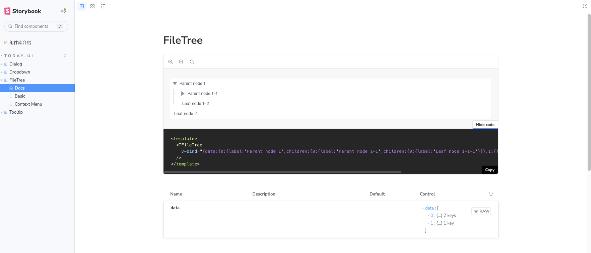

# Today-UI

想单独使用vue3 相关弹框类组件（tooltip,dropdown, menu, context,modal,confirm），不想引入一整个组件库,可以使用本组件库，本组件库准备做小而美的关于弹出层 vue3 组件库。

## 依赖

主要依赖 @floating-ui/vue。@floating-ui/vue 主要是对 @floating-ui/dom 的一个封装，@floating-ui/dom 是一个很好用的浮动元素的库，官方实现了 @floating-ui/react-dom。use-floating 是对标@floating-ui/react-dom 实现的一个底层对接@floating-ui/dom 的use hooks 库。

## 计划

[-]  第一个组件tooltip ，测试发包。

[-] 组件dropdown ，测试发包。

[-] 组件tree ，测试发包。

[x] 完善组件和样式

[x] 添加测试用例

[x] 发布正式版


## 使用

### 安装

```
# npm
npm install today-ui

# yarn
yarn add today-ui

# pnpm

pnpm add today-ui

```

### 示例

```
import TodayUI  from 'today-ui';
const app = createApp(App)

app.use(TodayUI);


<template>
    <div>
        <h2>component tooltip</h2>
        <t-tooltip :offset="20"  label="这是tooltip 的内容">
            <button>test button</button>
        </t-tooltip>
    </div>
</template>
 
<script lang="ts">
import { defineComponent } from 'vue'
export default defineComponent({
    setup() {
        return {}
    }
})
</script>

```

## 文档

[文档链接](https://wflixu.github.io/Today-UI/?path=/docs/%E7%BB%84%E4%BB%B6%E5%BA%93%E4%BB%8B%E7%BB%8D--docs)




## 参与

感兴趣的小伙伴，可以一块共同开发，或有什么想法，欢迎提issue


